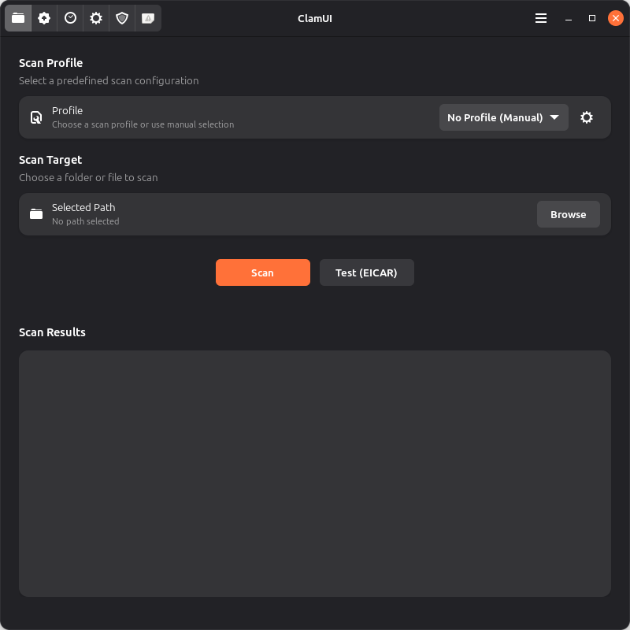
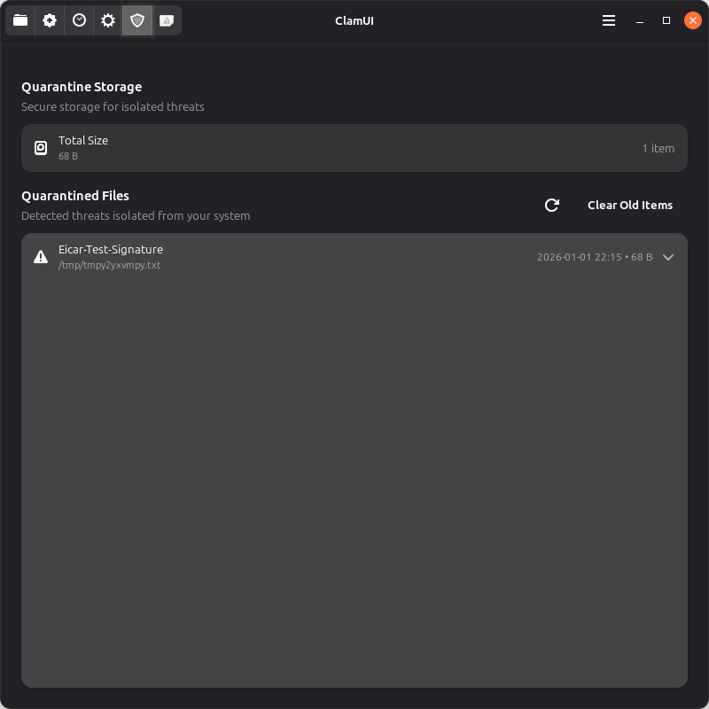
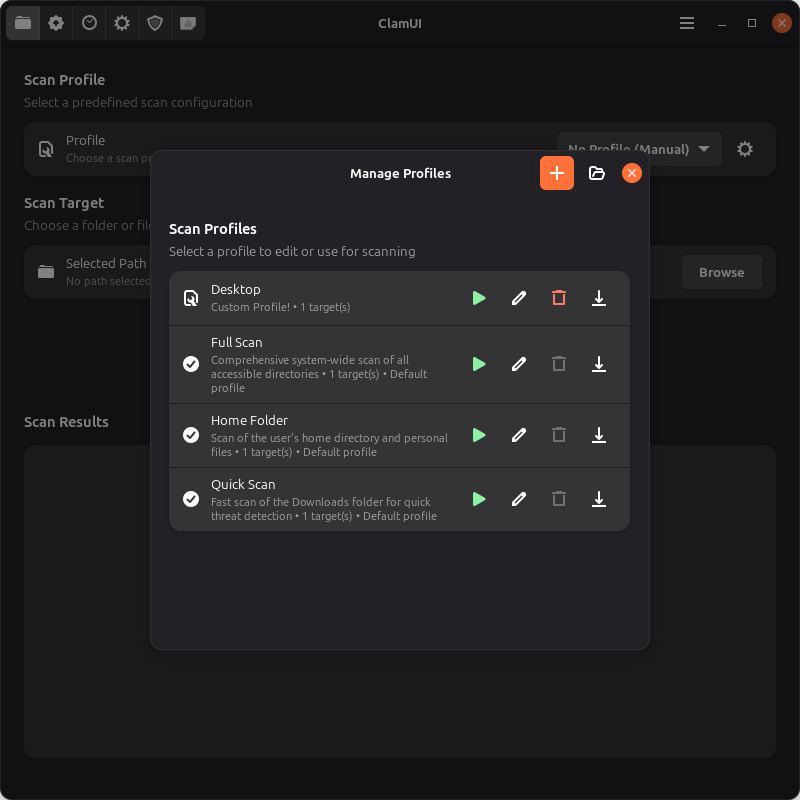
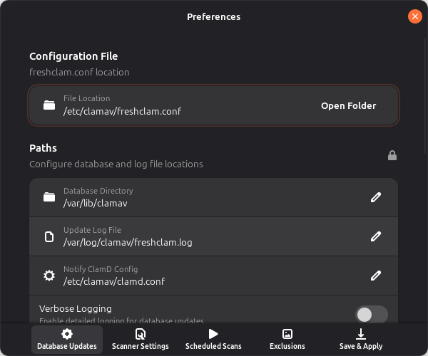

# ClamUI

A modern Linux desktop application that provides a graphical user interface for the ClamAV antivirus command-line tool. Built with PyGObject, GTK4, and Adwaita for a native GNOME appearance.


  
[  ](https://flathub.org/en/apps/io.github.linx_systems.ClamUI)


## Features

- **Easy File Scanning**: Select files or directories to scan using the native GTK4 file dialog
- **Async Scanning**: Background scanning keeps the UI responsive
- **Quarantine Management**: Isolate and manage detected threats safely
- **Scan Profiles**: Create custom scan configurations for different use cases
- **Scan History**: Track and review past scan results
- **Statistics Dashboard**: Monitor your scanning activity and threat detection
- **VirusTotal Integration**: Optional enhanced threat analysis via VirusTotal API
- **File Manager Integration**: Right-click "Scan with ClamUI" in Nautilus, Dolphin, and Nemo
- **System Tray**: Optional tray icon with quick actions and scan progress
- **Modern UI**: Native Adwaita styling with proper GNOME integration

## Screenshots

<table>
<tr>
<td></td>
<td></td>
</tr>
<tr>
<td align="center"><em>Scan Results</em></td>
<td align="center"><em>Quarantine Management</em></td>
</tr>
<tr>
<td></td>
<td></td>
</tr>
<tr>
<td align="center"><em>ClamAV Components Status</em></td>
<td align="center"><em>Scan History</em></td>
</tr>
<tr>
<td></td>
<td></td>
</tr>
<tr>
<td align="center"><em>Scan Profiles</em></td>
<td align="center"><em>Settings</em></td>
</tr>
</table>

## Quick Start

### Flatpak (Recommended)

```bash
flatpak install flathub io.github.linx_systems.ClamUI
flatpak run io.github.linx_systems.ClamUI
```

### From Source

```bash
git clone https://github.com/linx-systems/clamui.git
cd clamui
uv sync
uv run clamui
```

For detailed installation options including .deb packages and system-wide installation, see the [Installation Guide](./docs/INSTALL.md).

## Usage

1. Launch ClamUI from your application menu or terminal
2. Select a file or folder to scan
3. Click "Scan" to start the antivirus scan
4. View results and take action on any threats detected

For detailed usage instructions, see the [User Guide](./docs/USER_GUIDE.md).

### Command Line

```bash
# Launch the application
clamui

# Scan specific files directly
clamui /path/to/file1 /path/to/folder
```

## Configuration

ClamUI stores user preferences in `~/.config/clamui/settings.json` and can be configured through the Preferences dialog or by directly editing the JSON file.

### Key Configuration Options

- **Scan Backend**: Choose between automatic detection, daemon (clamd), or direct clamscan
- **Notifications**: Control desktop notifications for scan results and updates
- **Auto-Quarantine**: Automatically quarantine detected threats
- **Scheduled Scans**: Configure automatic scanning with systemd or cron
- **System Tray**: Enable start minimized and minimize to tray options
- **Scan Profiles**: Create custom scan configurations with exclusion patterns

For complete reference including all 15 settings, scan profiles, file locations, and configuration examples, see the [Configuration Reference](./docs/CONFIGURATION.md).

## Documentation

| Document | Description |
|----------|-------------|
| [User Guide](./docs/USER_GUIDE.md) | Complete guide to using ClamUI features |
| [Installation Guide](./docs/INSTALL.md) | Flatpak, .deb, context menu, and tray setup |
| [Troubleshooting Guide](./docs/TROUBLESHOOTING.md) | Common issues and solutions |
| [Development Guide](./docs/DEVELOPMENT.md) | Dev environment, testing, and contributing |
| [Scan Backend Guide](./docs/SCAN_BACKENDS.md) | Backend options, performance comparison, and selection guide |
| [Security Policy](./SECURITY.txt) | Security contact and reporting |

## Requirements

- **ClamAV**: The `clamscan` command-line tool must be installed
- **GTK4 + libadwaita**: For the graphical interface
- **Python 3.x**: With PyGObject bindings

See the [Installation Guide](./docs/INSTALL.md) for platform-specific dependency installation.

## Contributing

Contributions are welcome! Please see the [Development Guide](./docs/DEVELOPMENT.md) for:

- Setting up the development environment
- Running tests with coverage
- Code style guidelines
- Submitting pull requests

## License

This project is open source. See LICENSE file for details.
