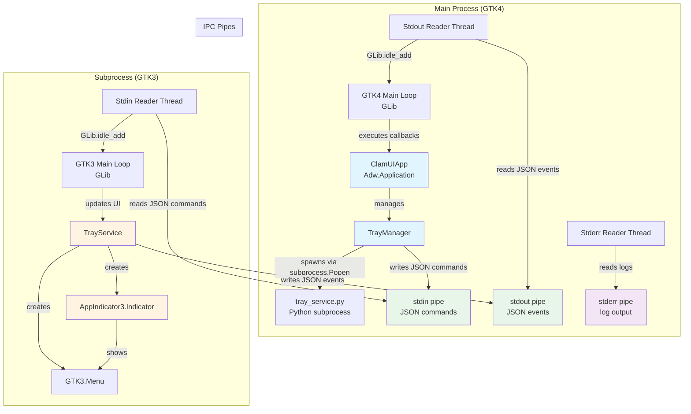
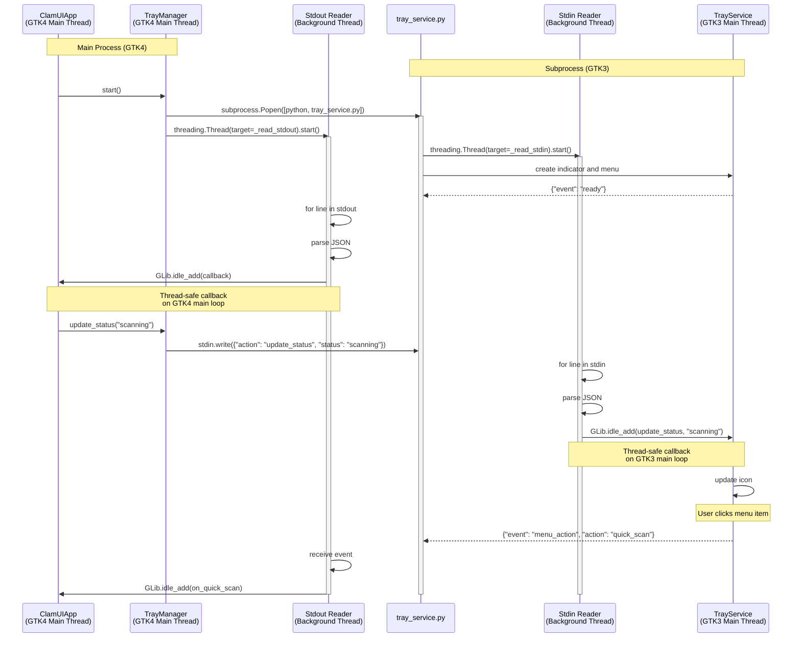

# System Tray Subprocess Architecture

## Overview

ClamUI uses a unique subprocess architecture for system tray integration to solve GTK3/GTK4 version conflicts. The main application runs with GTK4 (for modern Adwaita UI), while the system tray indicator runs in a separate subprocess with GTK3 (required by AppIndicator library).

This document explains the architecture, IPC protocol, and threading model.

## Why a Subprocess?

**Problem**: The AppIndicator library (used for native Linux system tray support) requires GTK3. However, the main ClamUI application uses GTK4 for Adwaita/GNOME integration. GTK3 and GTK4 cannot coexist in the same Python process due to GObject type system conflicts.

**Solution**: Run the tray indicator in a separate Python subprocess with its own GTK3 instance, communicating with the main GTK4 application via JSON messages over stdin/stdout pipes.

## Architecture Diagram



## Component Responsibilities

### Main Process Components

#### ClamUIApp (`src/app.py`)
- Main GTK4 application class inheriting from `Adw.Application`
- Manages application lifecycle and views
- Creates and owns the `TrayManager` instance
- Registers callbacks for tray menu actions

#### TrayManager (`src/ui/tray_manager.py`)
- Spawns the `tray_service.py` subprocess using `subprocess.Popen`
- Sends JSON commands to subprocess via stdin pipe
- Runs background threads to read stdout (events) and stderr (logs)
- Uses `GLib.idle_add()` to schedule callbacks on GTK4 main thread
- Implements message validation (size limits, nesting depth checks)
- Thread-safe with `threading.Lock()` for shared state

### Subprocess Components

#### TrayService (`src/ui/tray_service.py`)
- Standalone Python script that runs in separate process
- Loads GTK3 and AppIndicator3 libraries
- Creates the system tray indicator and menu
- Runs background thread to read stdin for commands
- Uses `GLib.idle_add()` to schedule UI updates on GTK3 main thread
- Sends JSON events to stdout

#### AppIndicator Integration
- Uses `AyatanaAppIndicator3` (or legacy `AppIndicator3`)
- Provides native Linux system tray icon
- Manages GTK3 context menu with scan actions
- Updates icon based on protection status

## Threading Model



### Thread Safety

Both processes use **GLib.idle_add()** to ensure GTK operations happen on the correct main thread:

- **TrayManager**: Stdout reader thread schedules callbacks on GTK4 main loop
- **TrayService**: Stdin reader thread schedules UI updates on GTK3 main loop

This prevents race conditions and GTK thread-safety violations.

### Shared State Protection

**TrayManager** uses `threading.Lock()` to protect shared state:
```python
with self._state_lock:
    self._running = True
    self._ready = False
    self._current_status = "protected"
```

## IPC Protocol

Communication uses JSON messages over stdin/stdout pipes.

### Message Format

All messages are single-line JSON objects followed by a newline:
```json
{"event": "ready"}\n
{"action": "update_status", "status": "scanning"}\n
```

### Commands (Main → Subprocess)

Sent via **stdin** to the subprocess:

| Action | Parameters | Description |
|--------|-----------|-------------|
| `update_status` | `status: str` | Update icon to reflect protection status<br/>Values: `"protected"`, `"warning"`, `"scanning"`, `"threat"` |
| `update_progress` | `percentage: int` | Show scan progress percentage (0-100)<br/>Use 0 to clear |
| `update_window_visible` | `visible: bool` | Update Show/Hide Window menu label |
| `update_profiles` | `profiles: List[dict]`<br/>`current_profile_id: str` | Update profiles submenu |
| `quit` | - | Gracefully stop the subprocess |
| `ping` | - | Health check (expects `pong` response) |

**Example**:
```json
{"action": "update_status", "status": "scanning"}
{"action": "update_progress", "percentage": 45}
```

### Events (Subprocess → Main)

Sent via **stdout** from the subprocess:

| Event | Parameters | Description |
|-------|-----------|-------------|
| `ready` | - | Subprocess initialized and ready |
| `menu_action` | `action: str`<br/>`profile_id: str` (optional) | User triggered menu action<br/>Actions: `"quick_scan"`, `"full_scan"`, `"update"`, `"quit"`, `"toggle_window"`, `"select_profile"` |
| `pong` | - | Response to `ping` command |
| `error` | `message: str` | Error occurred in subprocess |

**Example**:
```json
{"event": "ready"}
{"event": "menu_action", "action": "quick_scan"}
{"event": "menu_action", "action": "select_profile", "profile_id": "profile-123"}
```

### Security Considerations

**TrayManager** implements security validations:

1. **Message Size Limit**: Max 1MB per message to prevent memory exhaustion
   ```python
   MAX_MESSAGE_SIZE = 1024 * 1024  # 1MB
   ```

2. **Nesting Depth Limit**: Max 10 levels to prevent stack overflow
   ```python
   MAX_NESTING_DEPTH = 10
   ```

3. **Message Structure Validation**: All messages must have an `"event"` field

## Startup and Shutdown

### Startup Flow

1. **ClamUIApp** creates **TrayManager** instance
2. **TrayManager.start()** spawns subprocess:
   ```python
   self._process = subprocess.Popen(
       [sys.executable, "tray_service.py"],
       stdin=PIPE, stdout=PIPE, stderr=PIPE, text=True
   )
   ```
3. **TrayManager** starts stdout/stderr reader threads
4. **TrayService** creates AppIndicator and menu
5. **TrayService** sends `{"event": "ready"}` to stdout
6. **TrayManager** receives ready event and sets `_ready = True`

### Shutdown Flow

1. **ClamUIApp.do_shutdown()** calls **TrayManager.stop()**
2. **TrayManager** sends `{"action": "quit"}` command
3. **TrayService** receives command, calls `Gtk3.main_quit()`
4. **TrayManager** waits up to 2 seconds for graceful exit
5. If timeout expires, **TrayManager** terminates/kills subprocess
6. Reader threads exit when pipes close

## File Locations

| File | Description | GTK Version |
|------|-------------|-------------|
| `src/app.py` | Main application class | GTK4 |
| `src/ui/tray_manager.py` | Subprocess manager (main process) | GTK4 |
| `src/ui/tray_service.py` | Tray indicator service (subprocess) | GTK3 |
| `src/ui/tray_icons.py` | Icon generation utilities | None (PIL) |

## Common Patterns

### Sending a Command
```python
# In TrayManager (main process)
def update_status(self, status: str) -> None:
    self._send_command({"action": "update_status", "status": status})
```

### Handling an Event
```python
# In TrayManager (main process)
def _handle_menu_action(self, action: str, message: dict) -> None:
    if action == "quick_scan" and self._on_quick_scan:
        GLib.idle_add(self._on_quick_scan)  # Thread-safe callback
```

### Processing a Command in Subprocess
```python
# In TrayService (subprocess)
def handle_command(self, command: dict) -> None:
    action = command.get("action")
    if action == "update_status":
        status = command.get("status", "protected")
        GLib.idle_add(self.update_status, status)  # Thread-safe UI update
```

## Troubleshooting

### Tray Icon Not Appearing

1. Check if AppIndicator library is installed:
   ```bash
   dpkg -l | grep appindicator
   ```
2. Check subprocess logs in application output
3. Verify desktop environment supports system tray

### Commands Not Working

1. Enable debug logging: `export CLAMUI_DEBUG=1`
2. Check for JSON parse errors in logs
3. Verify stdin/stdout pipes are not buffered
4. Check for subprocess crashes in main app logs

### Thread Safety Issues

1. Always use `GLib.idle_add()` for GTK operations from threads
2. Use `threading.Lock()` for shared state
3. Never call GTK methods directly from reader threads

## References

- **AppIndicator Documentation**: https://lazka.github.io/pgi-docs/AyatanaAppIndicator3-0.1/
- **GTK3 Documentation**: https://docs.gtk.org/gtk3/
- **GTK4 Documentation**: https://docs.gtk.org/gtk4/
- **Python subprocess**: https://docs.python.org/3/library/subprocess.html
